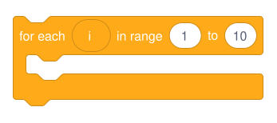

import {ExtensionCode} from './utils.js';

Duplicate on Drag is a feature that allows you to create reporter blocks that will duplicate once they are dragged. This is useful for loops and blocks that have temporal variables on them. For example, the `for each (i) in range (1) to (10)` block uses this feature for the `i` block:

Here, the `i` block represents the current number on the loop. If you put a `say (i) for (1) seconds` block inside of it, you can notice that it goes through every number from 1 to 10.

We can create our own block with similar functionality using the `duplicateOnDrag` property:

<ExtensionCode title="drag-to-duplicate">{require('!raw-loader!@site/static/example-extensions/drag-to-duplicate.js')}</ExtensionCode>

You can see there's two new properties, `duplicateOnDrag` and `shadow`.
- `duplicateOnDrag`: can only be used in reporters and booleans, this will tell the block that it is able to duplicate on drag.
- `shadow`: is used inside arguments, this tells it what block to use to "fill in" into the block's input, so that it appears there by default.
